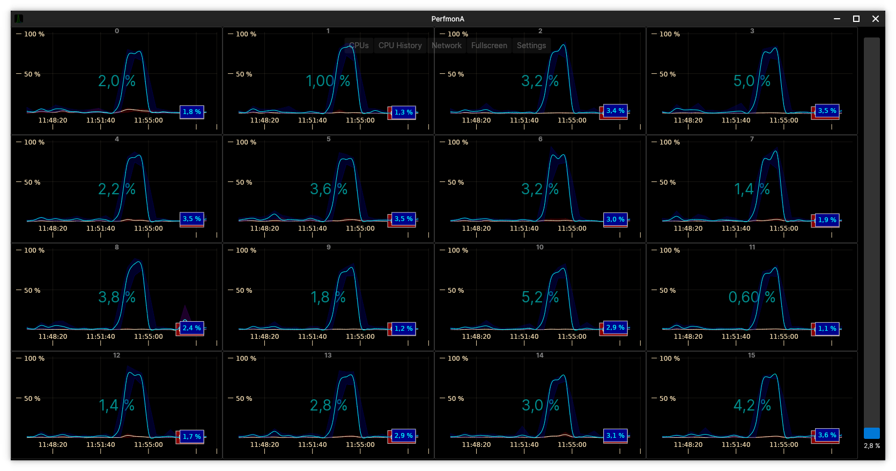

# PerfmonA

PerfmonA is a system monitor for medium term messurements, hours to days,
while not putting much load on the CPUs. This is achieved by allowing
modification of the sampling frequency and presentation intervals.

There are plenty of system monitors for Linux that gives snapshots second
by second, but that does not give the overview I usually want from a
performance monitor, like estimating the total load over time from running
a new program. uptime gives somewhat of a idea, but no historic trends. 

And it gave me an excuse to look at how to use Skia in Avalonia :).
Yes, it have a strange UI. I wanted it that way.

